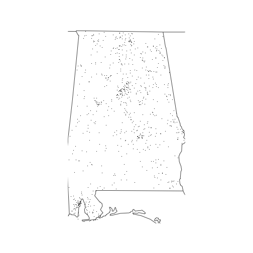

[](https://travis-ci.org/afterafx/theCourtyard)


###### A package created for Coursera, using data from the US National Highway Traffic Safety Administration.
###### The data used is specific to the Fatality Analysis Reporting System. The purpose of this package is to
###### demonstrate reading in the data, what years to input, summarize the data and map out the data by state.

#### Installation


```r
library(courseraPack)
```


#### Reading in data


```r
fars_read("accident_2013.csv.bz2")
```

```
## # A tibble: 30,202 x 50
##    STATE ST_CASE VE_TOTAL VE_FORMS PVH_INVL  PEDS PERNOTMVIT PERMVIT
##    <int>   <int>    <int>    <int>    <int> <int>      <int>   <int>
##  1     1   10001        1        1        0     0          0       8
##  2     1   10002        2        2        0     0          0       2
##  3     1   10003        1        1        0     0          0       1
##  4     1   10004        1        1        0     0          0       3
##  5     1   10005        2        2        0     0          0       3
##  6     1   10006        2        2        0     0          0       3
##  7     1   10007        1        1        0     0          0       1
##  8     1   10008        2        2        0     0          0       2
##  9     1   10009        1        1        0     0          0       1
## 10     1   10010        2        2        0     0          0       4
## # ... with 30,192 more rows, and 42 more variables: PERSONS <int>,
## #   COUNTY <int>, CITY <int>, DAY <int>, MONTH <int>, YEAR <int>,
## #   DAY_WEEK <int>, HOUR <int>, MINUTE <int>, NHS <int>, ROAD_FNC <int>,
## #   ROUTE <int>, TWAY_ID <chr>, TWAY_ID2 <chr>, MILEPT <int>,
## #   LATITUDE <dbl>, LONGITUD <dbl>, SP_JUR <int>, HARM_EV <int>,
## #   MAN_COLL <int>, RELJCT1 <int>, RELJCT2 <int>, TYP_INT <int>,
## #   WRK_ZONE <int>, REL_ROAD <int>, LGT_COND <int>, WEATHER1 <int>,
## #   WEATHER2 <int>, WEATHER <int>, SCH_BUS <int>, RAIL <chr>,
## #   NOT_HOUR <int>, NOT_MIN <int>, ARR_HOUR <int>, ARR_MIN <int>,
## #   HOSP_HR <int>, HOSP_MN <int>, CF1 <int>, CF2 <int>, CF3 <int>,
## #   FATALS <int>, DRUNK_DR <int>
```

#### Reads in data from a single or multiple years


```r
years <- c(2013, 2014)
data.list <- fars_read_years(years)
data.list
```

```
## [[1]]
## # A tibble: 30,202 x 2
##    MONTH  year
##    <int> <dbl>
##  1     1  2013
##  2     1  2013
##  3     1  2013
##  4     1  2013
##  5     1  2013
##  6     1  2013
##  7     1  2013
##  8     1  2013
##  9     1  2013
## 10     1  2013
## # ... with 30,192 more rows
## 
## [[2]]
## # A tibble: 30,056 x 2
##    MONTH  year
##    <int> <dbl>
##  1     1  2014
##  2     1  2014
##  3     1  2014
##  4     1  2014
##  5     1  2014
##  6     1  2014
##  7     1  2014
##  8     1  2014
##  9     1  2014
## 10     1  2014
## # ... with 30,046 more rows
```

#### Creates filename based on the year


```r
file <- make_filename(2014)
file
```

```
## [1] "accident_2014.csv.bz2"
```

#### Creates a summary of each year passed


```r
years.list <- c(2013, 2014)
fars_summarize_years(years.list)
```

```
## # A tibble: 12 x 3
##    MONTH `2013` `2014`
##  * <int>  <int>  <int>
##  1     1   2230   2168
##  2     2   1952   1893
##  3     3   2356   2245
##  4     4   2300   2308
##  5     5   2532   2596
##  6     6   2692   2583
##  7     7   2660   2696
##  8     8   2899   2800
##  9     9   2741   2618
## 10    10   2768   2831
## 11    11   2615   2714
## 12    12   2457   2604
```


#### Creates graph of accidents by state


```r
fars_map_state(1, 2013)
```


